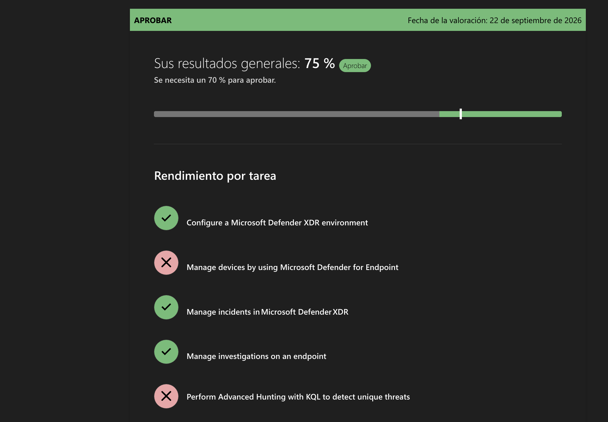
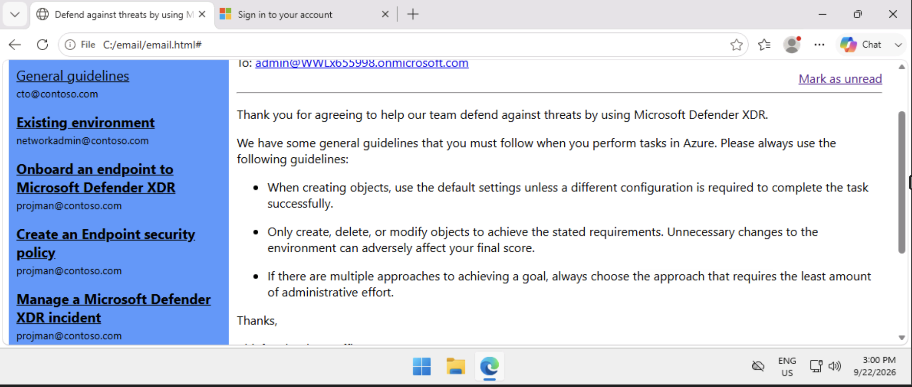
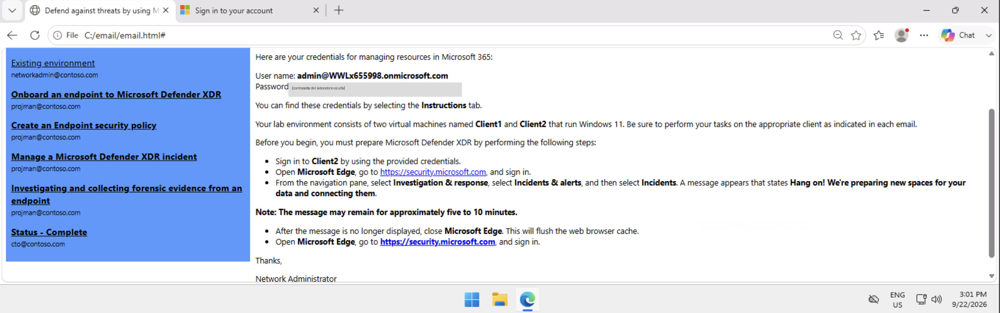
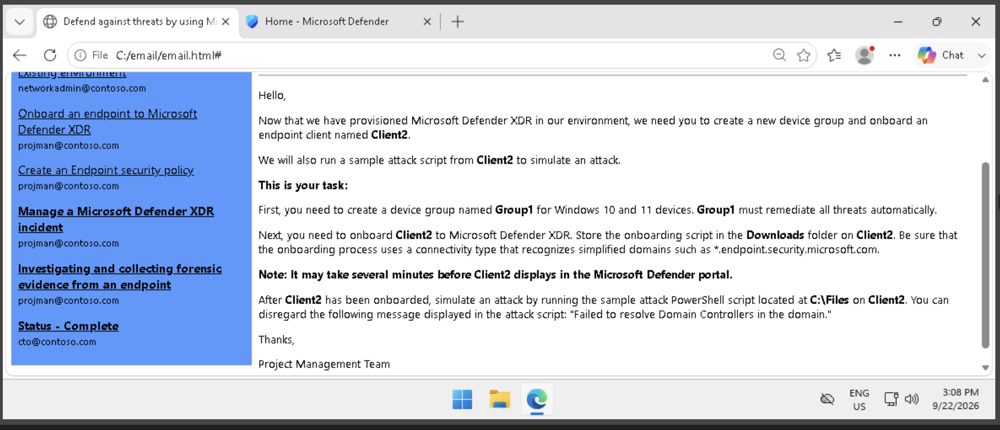
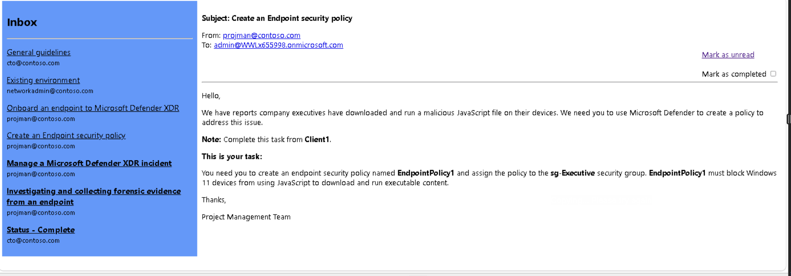
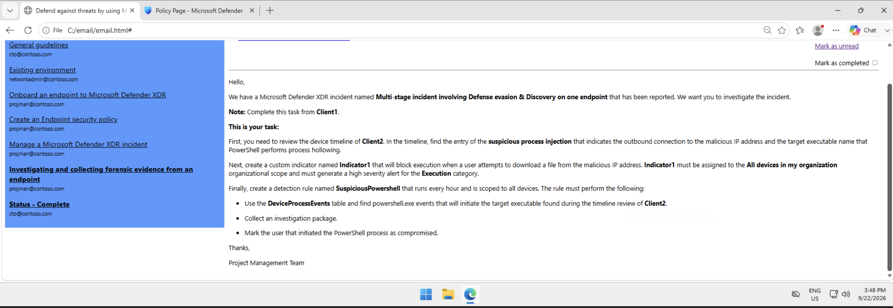
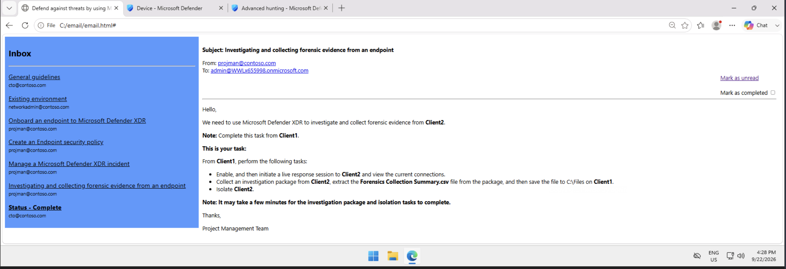

# Manual · Applied Skills: Defend against cyberthreats with Microsoft Defender XDR


---

# Cómo usar este manual y diagnóstico del 75 %

> **Recomendación:** Repite el laboratorio completo siguiendo este manual en orden. Lo que te separó del 100 % casi con seguridad fue (1) la política **EndpointPolicy1** (tarea "Manage devices by using Microsoft Defender for Endpoint") y (2) la regla de detección **SuspiciousPowershell** y su consulta KQL (tarea "Perform Advanced Hunting with KQL"). Los Ejercicios 2 y 3 incluyen una lista de errores típicos para esas dos tareas.



*Resultado actual: 75 %. Tareas en rojo: "Manage devices by using MDE" y "Perform Advanced Hunting with KQL".*

## Cómo se relacionan los ejercicios con las tareas evaluadas

| Tarea evaluada | Ejercicio del laboratorio | Estado |
|---|---|---|
| Configure a Microsoft Defender XDR environment | Ejercicio 1: Group1 + onboarding de Client2 | Aprobada |
| Manage devices by using Microsoft Defender for Endpoint | Ejercicio 2: EndpointPolicy1 (regla ASR) | Reprobada |
| Manage incidents in Microsoft Defender XDR | Ejercicio 3: línea de tiempo + Indicator1 | Aprobada |
| Perform Advanced Hunting with KQL | Ejercicio 3: regla SuspiciousPowershell | Reprobada |
| Manage investigations on an endpoint | Ejercicio 4: live response, paquete, aislamiento | Aprobada |

La relación entre ejercicios y tareas es una deducción a partir de los nombres, porque Microsoft no publica cómo califica. Aun así, conviene repetir todos los ejercicios con el mismo cuidado.

## Reglas de oro del laboratorio (vienen en el correo "General guidelines")



*Correo "General guidelines".*

- **Usa la configuración predeterminada** salvo que la tarea pida otra cosa. No actives opciones "por si acaso".
- **Crea, cambia o borra solo lo que se pide.** Los cambios de más pueden bajar tu calificación.
- **Elige siempre el camino más sencillo** (el que requiere menos esfuerzo administrativo).
- **Escribe los nombres exactamente igual**, con las mismas mayúsculas y sin espacios: Group1, EndpointPolicy1, Indicator1, SuspiciousPowershell.
- **Trabaja en la máquina correcta.** Cada correo dice si toca Client1 o Client2.
- Al terminar cada correo, marca la casilla **Mark as completed** para llevar el control.
- Algunas acciones tardan en aparecer (onboarding, incidente, paquete de investigación). Mientras esperas, avanza con la siguiente tarea.

## Convenciones

- Los menús del portal están en inglés, igual que en el laboratorio. Ejemplo: **Settings > Endpoints > Device groups**.
- Los recuadros grises con código se pueden copiar y pegar directamente.
- Portal de Microsoft Defender: **https://security.microsoft.com**


---

# PREPARACIÓN — Existing environment



*Correo "Existing environment" (se ocultó la contraseña del laboratorio).*

## De qué trata

El laboratorio te da un tenant de Microsoft 365 y dos máquinas virtuales con Windows 11: **Client1** y **Client2**. Antes de empezar hay que "despertar" Microsoft Defender XDR. La primera vez que entras a Incidents, el portal prepara los espacios de datos, lo que tarda de 5 a 10 minutos. Las credenciales están en la pestaña **Instructions** del laboratorio.

## Paso a paso

1. Inicia sesión en **Client2** con las credenciales de la pestaña **Instructions**.
2. Abre **Microsoft Edge** y entra a **https://security.microsoft.com** con el usuario admin@... del laboratorio.
3. En el menú de la izquierda ve a **Investigation & response > Incidents & alerts > Incidents**.
4. Aparece el mensaje **"Hang on! We're preparing new spaces for your data and connecting them"**. Espera a que desaparezca (de 5 a 10 minutos). No cierres la pestaña.
5. Cuando desaparezca, **cierra Microsoft Edge por completo** para limpiar la caché.
6. Abre Edge de nuevo, entra a **https://security.microsoft.com** e inicia sesión. Ya puedes empezar el Ejercicio 1.

*Consejo:* si el menú se ve incompleto (por ejemplo, no aparece "Endpoints"), espera un par de minutos y recarga la página con F5.


---

# EJERCICIO 1 — Onboard an endpoint to Microsoft Defender XDR



*Correo del Ejercicio 1 (se hace en Client2).*

## De qué trata

Hay que preparar Defender for Endpoint para proteger equipos. Primero se crea un **grupo de dispositivos** (Group1) para equipos con Windows 10 y 11 y se configura para que **corrija amenazas automáticamente**. Después se hace el **onboarding** de Client2: se descarga el paquete con conectividad **Streamlined** (la que usa dominios simplificados como *.endpoint.security.microsoft.com) en la carpeta **Downloads** y se ejecuta el script. Por último se lanza un ataque simulado desde Client2 para generar el incidente que se investiga en el Ejercicio 3.

## Parte A. Crear el grupo de dispositivos Group1

1. En **Client2**, en el portal de Defender, ve a **System > Settings > Endpoints**.
2. En la sección **Permissions**, selecciona **Device groups**. Enlace directo: https://security.microsoft.com/securitysettings/endpoints/machine_groups
3. Haz clic en **+ Add device group**.
4. En la página **General**, en **Device group name**, escribe **Group1**.
5. En **Automation level / Remediation level**, elige **Full - remediate threats automatically** (puede aparecer como "Full remediation"). Esto es lo que cumple "must remediate all threats automatically". Selecciona **Next**.
6. En la página **Devices**, configura la regla de pertenencia: en **OS** selecciona **Windows 10** y **Windows 11**. Deja vacíos Name, Domain y Tag. Selecciona **Next**.
7. En **Preview devices**, selecciona **Next**. Es normal que no aparezcan equipos porque Client2 todavía no está incorporado.
8. En **User access**, deja la configuración predeterminada (sin asignar grupos) y selecciona **Submit / Done**.
9. Si aparece un aviso para aplicar cambios, selecciona **Apply changes**.
10. Comprueba que **Group1** aparece en la lista con el nivel de corrección **Full**.

## Parte B. Incorporar (onboard) Client2 con conectividad Streamlined

1. En **Client2**, ve a **System > Settings > Endpoints > Device management > Onboarding**. Enlace directo: https://security.microsoft.com/securitysettings/endpoints/onboarding
2. En **Select operating system to start onboarding process**, elige **Windows 10 and 11**. *No elijas "Windows" a secas, porque abre otro flujo (Defender deployment tool).*
3. En **Connectivity type**, elige **Streamlined**.
4. En **Deployment method**, elige **Local script (for up to 10 devices)**.
5. Selecciona **Download onboarding package**. Edge guarda el archivo **GatewayWindowsDefenderATPOnboardingPackage.zip** en la carpeta **Downloads** de Client2. Si Edge pregunta, elige **Keep / Save**.
6. Abre el Explorador de archivos, entra a **Downloads**, haz clic derecho en el .zip y elige **Extract All**. Deja la carpeta de destino dentro de Downloads. **El script debe quedar guardado en Downloads.**
7. Abre **Símbolo del sistema como administrador**: menú Inicio, escribe cmd, clic derecho y **Run as administrator**.
8. Ejecuta estos comandos (el comando dir sirve para confirmar el nombre de la carpeta):

**Símbolo del sistema (administrador) en Client2**

```cmd
cd /d "%USERPROFILE%\Downloads"
dir
cd GatewayWindowsDefenderATPOnboardingPackage
WindowsDefenderATPLocalOnboardingScript.cmd
```

9. Cuando el script pregunte si quieres continuar, escribe **Y** y pulsa Enter. Al final muestra "Press any key to continue...". Pulsa cualquier tecla.
10. Espera de 5 a 15 minutos y revisa **Assets > Devices**: **client2** debe aparecer como **Onboarded**. En la columna o en la ficha del equipo verifica que pertenece a **Group1**.

## Parte C. Simular el ataque desde Client2

1. Confirma primero que Client2 ya aparece en el portal. Si ejecutas el ataque antes de terminar el onboarding, no se registra.
2. En **Client2**, abre **Windows PowerShell como administrador**.
3. Ejecuta los siguientes comandos. Cambia <nombre-del-script> por el archivo .ps1 que muestre dir en C:\Files:

**PowerShell (administrador) en Client2**

```powershell
cd C:\Files
dir
Set-ExecutionPolicy -ExecutionPolicy Bypass -Scope Process -Force
.\<nombre-del-script>.ps1
```

4. Ignora el mensaje **"Failed to resolve Domain Controllers in the domain"**; el propio correo dice que es esperado.
5. Si se abre el **Bloc de notas (notepad.exe)**, déjalo abierto. Es parte de la simulación: el script inyecta código en notepad.exe.
6. El incidente **"Multi-stage incident involving Defense evasion & Discovery on one endpoint"** puede tardar de 10 a 30 minutos en aparecer. Mientras tanto, avanza con el Ejercicio 2.

## Errores comunes

- Poner un nivel de automatización distinto de **Full** (por ejemplo, Semi).
- No agregar ambas versiones, Windows 10 **y** Windows 11, en la condición de sistema operativo.
- Descargar el paquete con **Standard** en lugar de **Streamlined**.
- Guardar o extraer el paquete fuera de Downloads, o descargarlo desde Client1.
- Ejecutar el script sin permisos de administrador.


---

# EJERCICIO 2 — Create an Endpoint security policy



*Correo del Ejercicio 2 (se hace en Client1).*

## De qué trata

Algunos directivos descargaron y ejecutaron un archivo JavaScript malicioso. Para evitarlo se crea una **política de seguridad de endpoint** del tipo **Attack Surface Reduction (ASR) rules**. Las reglas ASR bloquean comportamientos típicos del malware. La regla que se necesita es **"Block JavaScript or VBScript from launching downloaded executable content"** (GUID d3e037e1-3eb8-44c8-a917-57927947596d) en modo **Block**. La política se llama EndpointPolicy1 y se asigna al grupo de seguridad sg-Executive.

> **Atención:** Esta tarea salió **reprobada**. Lo más probable es que la regla quedara en **Audit** o **Not configured** en vez de **Block**, que el nombre estuviera mal escrito, que faltara asignar **sg-Executive** o que se activaran reglas de más.

## Paso a paso

1. Inicia sesión en **Client1**, abre Edge y entra a **https://security.microsoft.com**.
2. Ve a **Endpoints > Configuration management > Endpoint security policies**. Enlace directo: https://security.microsoft.com/policy-inventory
3. En la pestaña **Windows policies**, selecciona **+ Create new policy**.
4. En **Select platform**, elige **Windows**. No elijas "Windows (ConfigMgr)".
5. En **Select template**, elige **Attack Surface Reduction Rules** y selecciona **Create policy**.
6. En la página **Basics**, en **Name** escribe **EndpointPolicy1**. La descripción es opcional. Selecciona **Next**.
7. En **Configuration settings**, usa el buscador para encontrar **Block JavaScript or VBScript from launching downloaded executable content**.
8. Cambia su valor a **Block**. Deja **todas las demás reglas en Not configured**. Selecciona **Next**.
9. En **Assignments**, busca **sg-Executive**, selecciónalo y confirma que **Target type** sea **Include**. Selecciona **Next**.
10. En **Review + create**, revisa el nombre, la regla en Block y la asignación. Selecciona **Save**.
11. Comprueba que **EndpointPolicy1** aparece en la pestaña **Windows policies**.

> **Nota:** Plan B: si el portal de Defender no deja crear la política (por ejemplo, porque la administración de configuración de seguridad no está disponible), créala igual en el Intune admin center (https://intune.microsoft.com). Ruta: **Endpoint security > Attack surface reduction > + Create policy**, con Platform **Windows** y Profile **Attack Surface Reduction Rules**. Usa el mismo nombre, la misma regla en Block y la misma asignación.

## Checklist antes de marcar como completado

- Nombre exacto: **EndpointPolicy1**.
- Plataforma **Windows** y plantilla **Attack Surface Reduction Rules**.
- Una sola regla configurada: **Block JavaScript or VBScript from launching downloaded executable content = Block**.
- Asignada (Include) al grupo **sg-Executive**.


---

# EJERCICIO 3 — Manage a Microsoft Defender XDR incident



*Correo del Ejercicio 3 (se hace en Client1).*

## De qué trata

Se investiga el incidente que generó el ataque simulado del Ejercicio 1. Tiene tres partes: (1) revisar la **línea de tiempo (timeline)** de Client2 para encontrar la **inyección de proceso sospechosa**, identificando la **IP maliciosa** y el **ejecutable objetivo** en el que PowerShell hace *process hollowing*; (2) crear el indicador **Indicator1** que bloquee esa IP; (3) crear la regla de detección personalizada **SuspiciousPowershell** con una consulta KQL que se ejecute cada hora y actúe automáticamente.

En la simulación oficial de Microsoft ("Investigate and respond using Microsoft Defender"), PowerShell inyecta código en **notepad.exe** y notepad.exe contacta una IP externa que simula el servidor de comando y control (C2). Por eso el ejecutable objetivo esperado es **notepad.exe**. Confírmalo en tu timeline.

> **Atención:** La parte de la regla de detección salió **reprobada** ("Perform Advanced Hunting with KQL"). Causa más probable: la consulta no devolvía las columnas que la regla necesita para sus acciones. **Mark user as compromised** requiere la columna **InitiatingProcessAccountObjectId**, y **Collect investigation package** requiere **DeviceId**. También cuenta si la frecuencia no era "Every hour" o el alcance no era "All devices".

## Parte A. Revisar la línea de tiempo de Client2

1. En **Client1**, ve a **Incidents & alerts > Incidents** y abre **"Multi-stage incident involving Defense evasion & Discovery on one endpoint"** para ver el contexto.
2. Ve a **Assets > Devices** y abre **client2**. Selecciona la pestaña **Timeline**.
3. Usa el buscador del timeline, por ejemplo con "injection" o "notepad", o filtra por alertas. Busca el evento **"Suspicious process injection observed"** y, debajo, **"powershell.exe injected to notepad.exe"**.
4. Abre el evento. En el panel lateral verás el árbol de procesos: **powershell.exe > notepad.exe**. Anota el ejecutable objetivo: **notepad.exe**.
5. En el mismo árbol, o en el evento de conexión de red de notepad.exe (por ejemplo, "notepad.exe established connection with ..."), **anota la IP remota**. Esa es la IP maliciosa.

**Consultas de apoyo (opcionales)** para confirmar la IP y el ejecutable desde **Hunting > Advanced hunting**. Solo sirven para consultar; no crean nada en el ambiente.

**KQL de apoyo 1: IP a la que se conectó notepad.exe en Client2**

```kusto
DeviceNetworkEvents
| where DeviceName contains "client2"
| where InitiatingProcessFileName =~ "notepad.exe"
| project Timestamp, DeviceName, InitiatingProcessFileName,
          RemoteIP, RemotePort, RemoteUrl, ActionType
| order by Timestamp desc
```

**KQL de apoyo 2: procesos que lanzó powershell.exe en Client2**

```kusto
DeviceProcessEvents
| where DeviceName contains "client2"
| where InitiatingProcessFileName =~ "powershell.exe"
| project Timestamp, DeviceName, FileName, ProcessCommandLine,
          InitiatingProcessCommandLine
| order by Timestamp desc
```

## Parte B. Crear Indicator1 (bloquear la IP maliciosa)

1. Ve a **System > Settings > Endpoints > Rules > Indicators**.
2. Abre la pestaña **IP addresses and URLs/Domains** y selecciona **+ Add item**.
3. **Indicator**: en **IP address** escribe la IP que anotaste. Deja **Expires on** en **Never** (predeterminado). Selecciona **Next**.
4. **Action**: elige **Block execution**. En **Title** escribe **Indicator1** y agrega una descripción breve si es obligatoria (por ejemplo, "Malicious IP from incident").
5. Marca **Generate alert**. En **Severity** elige **High**. En **Category** elige **Execution**. Deja vacíos MITRE techniques y Recommended actions. Selecciona **Next**.
6. **Scope**: elige **All devices in my organization**. Selecciona **Next**.
7. **Summary**: revisa y selecciona **Save**.

## Parte C. Crear la regla de detección SuspiciousPowershell

**Consulta KQL final (copiar y pegar).** Se basa en la documentación oficial de Microsoft. La tabla **DeviceProcessEvents** registra la creación de procesos; **InitiatingProcessFileName** es quien lanza el proceso (powershell.exe) y **FileName** es el proceso que se crea (el ejecutable objetivo, notepad.exe). No lleva *project*, así que devuelve todas las columnas que la regla necesita (Timestamp, DeviceId, ReportId e InitiatingProcessAccountObjectId). Tampoco filtra por fecha, porque Microsoft recomienda no hacerlo en reglas personalizadas: el servicio aplica el periodo de revisión automáticamente.

**KQL FINAL: regla SuspiciousPowershell (recomendada)**

```kusto
DeviceProcessEvents
| where InitiatingProcessFileName =~ "powershell.exe"
| where FileName =~ "notepad.exe"
```

Versión alternativa, que da el mismo resultado pero muestra de forma explícita las columnas que usan las acciones. Úsala si prefieres ver solo esas columnas:

**KQL FINAL alternativa (con project)**

```kusto
DeviceProcessEvents
| where InitiatingProcessFileName =~ "powershell.exe"
| where FileName =~ "notepad.exe"
| project Timestamp, DeviceId, DeviceName, ReportId,
          FileName, ProcessCommandLine,
          InitiatingProcessFileName, InitiatingProcessCommandLine,
          InitiatingProcessAccountName, InitiatingProcessAccountDomain,
          InitiatingProcessAccountSid, InitiatingProcessAccountUpn,
          InitiatingProcessAccountObjectId
```

> **Nota:** Si en tu timeline el ejecutable objetivo **no** es notepad.exe, cambia solo el valor "notepad.exe" por el que encontraste en la Parte A.

1. Ve a **Investigation & response > Hunting > Advanced hunting**. Abre una pestaña de consulta nueva.
2. Pega la **KQL FINAL**. Pon el rango de tiempo en **Last 30 days** y selecciona **Run query**. Deben salir resultados con powershell.exe como proceso que inicia y notepad.exe como proceso creado. Revisa que existan las columnas **DeviceId**, **ReportId** e **InitiatingProcessAccountObjectId**.
3. Selecciona **Create detection rule**, arriba a la derecha. También puedes ir a **Hunting > Custom detection rules > + Create detection rule** y pegar la consulta ahí.
4. **Alert details / General**: en **Detection name** escribe **SuspiciousPowershell**. En **Frequency** elige **Every hour**. En **Alert title** escribe **SuspiciousPowershell**. Como el correo no especifica **Severity** ni **Category**, elige valores lógicos: por ejemplo, **Medium** y **Execution**. Escribe una descripción breve y selecciona **Next**.
5. **Alert enrichment / Impacted entities** (si aparece): para Device elige **DeviceId**; para User/Account elige **InitiatingProcessAccountSid** o **InitiatingProcessAccountObjectId**. Selecciona **Next**.
6. **Actions**: en **Devices** marca **Collect investigation package**. En **Users** marca **Mark user as compromised** y, si pide columna, elige **InitiatingProcessAccountObjectId**. No marques ninguna otra acción. Selecciona **Next**.
7. **Scope**: elige **All devices**. Selecciona **Next**.
8. **Review and create**: revisa y selecciona **Submit / Create**.
9. Comprueba en **Hunting > Custom detection rules** que **SuspiciousPowershell** aparece con estado **On** y frecuencia **Every hour**.

## Checklist antes de marcar como completado

| Elemento | Valor esperado |
|---|---|
| Indicator1: tipo | IP address (la IP maliciosa de notepad.exe) |
| Indicator1: acción | Block execution + Generate alert |
| Indicator1: alerta | Severity High, Category Execution |
| Indicator1: scope | All devices in my organization |
| Regla: nombre | SuspiciousPowershell |
| Regla: tabla | DeviceProcessEvents (powershell.exe inicia notepad.exe) |
| Regla: frecuencia | Every hour |
| Regla: acciones | Collect investigation package + Mark user as compromised |
| Regla: scope | All devices |


---

# EJERCICIO 4 — Investigating and collecting forensic evidence from an endpoint



*Correo del Ejercicio 4 (se hace en Client1).*

## De qué trata

Es la respuesta a incidentes en Client2, trabajando desde Client1. Hay tres acciones: (1) **activar Live Response**, abrir una sesión remota en Client2 y ver sus conexiones activas; (2) **recolectar el paquete de investigación** (un .zip con evidencia forense), extraer el archivo **Forensics Collection Summary.csv** y guardarlo en **C:\Files** de Client1; (3) **aislar** Client2 de la red.

> **Nota:** El orden importa: primero Live Response, luego el paquete de investigación y al final el aislamiento. El paquete y el aislamiento pueden tardar varios minutos.

## Parte A. Activar Live Response y ver conexiones

1. En **Client1**, ve a **System > Settings > Endpoints > General > Advanced features**.
2. Activa **Live Response** (On). No actives otras opciones, como Live Response for Servers o unsigned scripts, porque no se piden.
3. Baja hasta el final y selecciona **Save preferences**.
4. Ve a **Assets > Devices** y abre **client2**.
5. En la barra de acciones, o en el menú **...**, selecciona **Initiate Live Response Session**. Espera a que diga **Connected**.
6. En la consola escribe el siguiente comando y pulsa Enter para ver las conexiones activas:

**Consola de Live Response**

```text
connections
```

7. Revisa la salida y luego selecciona **Disconnect session** > **Confirm**.

## Parte B. Recolectar el paquete de investigación y extraer el CSV

1. En la ficha de **client2**, selecciona **Collect investigation package** (puede estar dentro del menú **...**).
2. Escribe un comentario (por ejemplo, "Forensic evidence") y selecciona **Confirm**.
3. Espera de 5 a 15 minutos. Abre **Action center** desde la ficha del equipo. En la acción "Collect investigation package", selecciona **Package collection package available** para descargar el .zip. Se guarda en **Downloads** de Client1.
4. En el Explorador de archivos de Client1, haz clic derecho en el .zip > **Extract All**.
5. Dentro de la carpeta extraída, busca el archivo **Forensics Collection Summary.csv**. Puedes usar el buscador del Explorador.
6. Copia **solo ese archivo** a **C:\Files** en Client1, sin cambiarle el nombre. Resultado: **C:\Files\Forensics Collection Summary.csv**.

## Parte C. Aislar Client2

1. En la ficha de **client2**, selecciona **Isolate device**.
2. Deja la configuración predeterminada (**Full isolation**) y **no** marques la excepción para Outlook, Teams o Skype.
3. Escribe un comentario y selecciona **Confirm**.
4. En **Action center**, verifica que la acción de aislamiento quede en **Completed**. Puede tardar unos minutos.

## Errores comunes

- Aislar Client2 antes de terminar el paquete de investigación.
- Copiar el .zip completo o renombrar el CSV en lugar de dejar el archivo exacto en C:\Files.
- Hacer las acciones desde Client2 en lugar de Client1.


---

# Apéndice: conceptos básicos de Microsoft Defender

| Concepto | Explicación sencilla |
|---|---|
| Microsoft Defender XDR | Consola unificada (security.microsoft.com) que reúne la protección de equipos, identidades, correo y apps, y agrupa las alertas en incidentes. |
| Defender for Endpoint (MDE) | La protección de equipos (EDR): detecta, investiga y responde a amenazas en Windows, macOS, Linux y móviles. |
| Onboarding | Conectar un equipo a Defender for Endpoint para que envíe telemetría. En pocos equipos se hace con un script local. |
| Streamlined connectivity | Método de conexión con menos URL (por ejemplo, *.endpoint.security.microsoft.com). Simplifica los firewalls y proxies. |
| Device group | Grupo de equipos para dar permisos y definir el nivel de corrección automática (Full = corrige solo). |
| Endpoint security policy | Política que se crea en Defender o Intune para aplicar configuraciones de seguridad (antivirus, firewall, ASR) a grupos. |
| Reglas ASR | Reglas que bloquean comportamientos típicos del malware, como scripts que descargan ejecutables o macros de Office. |
| Alerta vs. incidente | Una alerta es una señal individual. Un incidente agrupa varias alertas relacionadas en una sola historia del ataque. |
| Device timeline | Registro cronológico de todo lo que pasó en un equipo (procesos, red, archivos, registro). |
| Indicador (IoC) | Archivo, IP, URL o certificado al que se aplica una acción: permitir, auditar, avisar o bloquear. |
| Advanced hunting | Búsqueda proactiva de amenazas con consultas KQL sobre hasta 30 días de datos. |
| KQL | Kusto Query Language. Se lee de arriba hacia abajo: tabla | filtro (where) | columnas (project) | orden (order by). |
| Custom detection rule | Consulta KQL que se ejecuta de forma periódica y genera alertas y acciones automáticas. |
| Live Response | Consola remota para investigar un equipo en vivo (procesos, conexiones, archivos). |
| Investigation package | Archivo .zip con evidencia forense del equipo (procesos, red, tareas programadas, usuarios, etc.). |
| Isolate device | Aísla el equipo de la red y solo mantiene su conexión con Defender, para contener un ataque. |

## Mini guía de KQL para empezar

**Ejemplo comentado (solo para aprender; no es la consulta del examen)**

```kusto
DeviceProcessEvents                                  // 1. Tabla
| where Timestamp > ago(7d)                          // 2. Filtro de tiempo
| where FileName =~ "powershell.exe"                 // 3. Filtro (=~ ignora mayúsculas)
| project Timestamp, DeviceName, ProcessCommandLine  // 4. Columnas a mostrar
| order by Timestamp desc                            // 5. Orden
| take 50                                            // 6. Limitar resultados
```

## Referencias oficiales de Microsoft Learn

- Applied Skill: learn.microsoft.com/credentials/applied-skills/defend-against-cyberthreats-with-microsoft-defender-xdr/
- Device groups: learn.microsoft.com/defender-endpoint/machine-groups
- Onboarding con script local: learn.microsoft.com/defender-endpoint/configure-endpoints-script
- Streamlined connectivity: learn.microsoft.com/defender-endpoint/configure-device-connectivity
- Endpoint security policies en Defender: learn.microsoft.com/defender-endpoint/endpoint-security-policies-configure
- Referencia de reglas ASR: learn.microsoft.com/defender-endpoint/attack-surface-reduction-rules-reference
- Indicadores IP/URL: learn.microsoft.com/defender-endpoint/indicator-ip-domain
- Custom detection rules: learn.microsoft.com/defender-xdr/custom-detection-rules
- Tabla DeviceProcessEvents: learn.microsoft.com/defender-xdr/advanced-hunting-deviceprocessevents-table
- Simulación oficial (powershell > notepad.exe): learn.microsoft.com/defender-xdr/pilot-deploy-investigate-respond
- Live Response: learn.microsoft.com/defender-endpoint/live-response
- Acciones de respuesta (paquete, aislamiento): learn.microsoft.com/defender-endpoint/respond-machine-alerts
